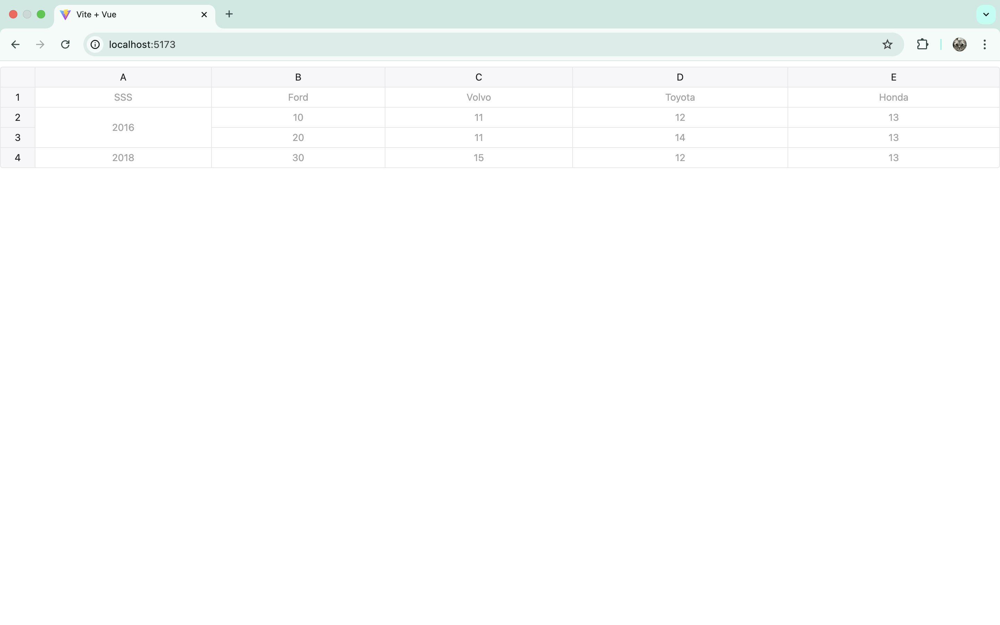

## 🧪 表格组件对比示例项目

本项目演示了三种主流 JavaScript 表格组件的基本使用：

- ✅ [**Handsontable**](https://handsontable.com/)
- ✅ [**JSpreadsheet**](https://jspreadsheet.com/)
- ✅ [**Ag-Grid**](https://www.ag-grid.com/)

### 🚀 快速开始

```bash
pnpm install

pnpm run dev
```

### 📺 项目截图


